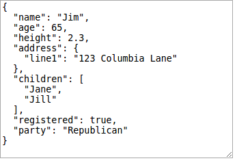

## Json Encoding

*Elm Version: 0.17.0*

[Try it online here](https://alexspurling.github.io/elm-recipes/json-encoding/)

This tutorial covers:

* How to encode a type to a Json String

Recommended background:

* [Json Parsing tutorial](../json-parsing/)

Compared the parsing, Json encoding is relatively straightforward. Elm provides functions to encode values of each
primitive type in the [Json.Encode](http://package.elm-lang.org/packages/elm-lang/core/4.0.1/Json-Encode) module. Let's
use the same model that we used in the Json Parsing tutorial.

```elm
type alias Voter =
  { name : String
  , age : Int
  , height : Float
  , address : Address
  , children : List String
  , registered : Bool
  , party : Party
  }

type Party = Republican | Democrat

type alias Address =
  { line1 : String
  }
```

#### Creating an Encoder

Encoders are simply functions that take a value of the type you want to encode, and return a json `Value`. Because we
already know the types of the values we're dealing with, Json encoders can be implemented as plain pure functions with
no need for error handling.

```elm
import Json.Encode exposing (encode, Value, string, int, float, bool, list, object)

encodeVoter : Voter -> Value
encodeVoter voter =
  object
    [ ("name", string voter.name)
    , ("age", int voter.age)
    , ("height", float voter.height)
    , ("address", encodeAddress voter.address)
    , ("children", list (List.map string voter.children))
    , ("registered", bool voter.registered)
    , ("party", encodeParty voter.party)
    ]
```

Here, we are using the functions provided by the `Json.Encode` module such as `string`, `int`, `float` etc. to encode
the fields of our type to `Value`s. The function `object` allows us to combine these simple values into a Json object.
It has the following signature:

```elm
object : List (String, Value) -> Value
```

The `String` in the tuple is the field name, and the `Value` is the value - all pretty straightforward. Next let's take
a look at the `list` function:


```elm
list : List Value -> Value
```

This simply creates a Json array from a provided list of `Value` instances. In our case, I am using `List.map` to convert
the strings in our `voter.children` to a json `Value`.

Finally, let's look at the two custom encode functions:

```elm
encodeAddress : Address -> Value
encodeAddress address =
  object [("line1", string address.line1)]

encodeParty : Party -> Value
encodeParty party =
  case party of
    Republican -> string "Republican"
    Democrat -> string "Democrat"
```

As you can see, these functions take a value of their respective types and produce json `Value` instances. Finally to
actually convert a `Value` to a String, we call the `Json.Encode.encode` function:

```
voterToJson : Voter -> String
voterToJson voter =
  encode 2 (encodeVoter voter)
```

[Try it online here](https://alexspurling.github.io/elm-recipes/json-encoding/)

Converting an Elm value to Json string:



#### Further reading

* [Json Parsing tutorial](../json-parsing/)
* [Json-to-Elm](http://noredink.github.io/json-to-elm/) is a tool that automatically produces your Encoder/Decoder Elm code for you given a sample Json file. This is a good place to start but does not support union types.
