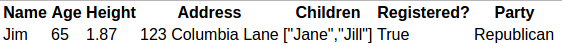
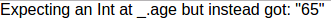
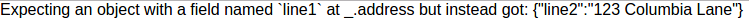
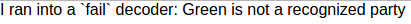

## Json Parsing

*Elm Version: 0.17.0*

This tutorial covers:

* How to parse a simple Json document
* How to create an Elm Json Decoder
* How to chain Decoders
* How to handle parsing errors

Elm provides the [Json.Decode](http://package.elm-lang.org/packages/elm-lang/core/4.0.1/Json-Decode) module as part of the core library. Let's use this to decode a simple Json string into an Elm model.

Here's a simple Json document with fields of various different types:

```
{
  "name": "Jim",
  "age": 65,
  "height": 1.87,
  "address": {
    "line1": "123 Columbia Lane"
  },
  "children": ["Jane", "Jill"],
  "registered": true,
  "party": "Republican"
}
```

Let's build an Elm model to represent this structure:

```elm
type alias Voter =
  { name : String
  , age : Int
  , height : Float
  , address : Address
  , children : List String
  , registered : Bool
  , party : Party
  }

type Party = Republican | Democrat

type alias Address =
  { line1 : String
  }
```

#### Creating a Decoder

Before we even touch the input json string above, we first need to create a `Decoder Voter` which is some type that understands how to convert Json data into a value of type `Voter`. You cannot create a `Decoder` from scratch, the only way to create a `Decoder` for a complex type is to combine already existing `Decoder`s of simpler types. Fortunately, the `Json.Decoder` module exposes functions to return `Decoder`s for all the Json primitive types such as `string`, `int` and `list`.

Let's look at our first `Decoder` function:

```elm
import Json.Decode exposing (Decoder, (:=), object7, int, string, float, bool, list)

voterDecoder : Decoder Voter
voterDecoder =
  object7 Voter
    ("name" := string)
    ("age" := int)
    ("height" := float)
    ("address" := addressDecoder)
    ("children" := (list string))
    ("registered" := bool)
    ("party" := partyDecoder)
```

There's quite a lot going on here, so let's break it down. First of all, we know we want to decode a Json object with 7 fields (name, age, height etc). The Decoder module provides a function `object7` which takes a constructor followed by 7 arguments. To this we are passing a constructor function for our `Voter` type followed by 7 other `Decoder`s one representing each of the fields in our object.

A Decoder that looks like this `("name" := string)` means, take the field "name" of the current Json object and decode it using the `string` Decoder. See the documentation for the [:= function](http://package.elm-lang.org/packages/elm-lang/core/4.0.1/Json-Decode#:=). Similarly, the other field decoders are created by referencing already existing primitive decoders (float, boolean, list), or by calling a custom `Decoder`.

Here is our `Address` `Decoder`:

```
addressDecoder : Decoder Address
addressDecoder =
  object1 Address ("line1" := string)
```

This is quite a straightforward `Decoder`, we expect the value to be decoded to be an object with a single field so we call `object1` with a constructor for our `Address` type, and another `Decoder` to decode the expected "line1" field.


#### Decoding a union type

Our next `Decoder` looks like this:

```elm
import Json.Decode exposing (andThen, succeed, fail)

partyDecoder : Decoder Party
partyDecoder =
  string `andThen` partyFromString

partyFromString : String -> Decoder Party
partyFromString party =
  case (toLower party) of
    "republican" ->
      succeed Republican
    "democrat" ->
      succeed Democrat
    _ ->
      fail (party ++ " is not a recognized party")
```

We expect the "party" field to be a string with one of two possible values. We use the same field extractor function from before (`:=`) but this time we chain it with another decoder that can convert the string into a valid value of type `Party`. Note how we use the `succeed` and `fail` functions which allow use to signal a successful or fails parse of the input value. This error will be propgated

Alternatively, if we did not want to handle an unknown party as an error, we could just define it as another valid option. All we then need to do, is pass a function to `Json.Decode.map` to tell it how to construct a Party from a String:

```elm
import Json.Decode exposing (map)

type Party = Republican | Democrat | Other

partyDecoder : Decoder Party
partyDecoder =
  map partyFromString ("party" := string)

partyFromString : String -> Party
partyFromString party =
  case (toLower party) of
    "republican" ->
      Republican
    "democrat" ->
      Democrat
    _ ->
      Other
```

#### Actually parsing the Json

Finally, let's actually parse some Json using our new shiny `Decoder`:

```elm
import Json.Decode exposing (decodeString)

viewVoter : Voter -> Html msg
viewVoter = ... --elided for brevity

viewParseResult : Result String Voter -> Html a
viewParseResult voterParseResult =
  case voterParseResult of
    Ok voter -> viewVoter voter
    Err error -> div [ ] [ text error ]

main : Html msg
main = viewParseResult (decodeString voterDecoder voterJson)
```

The function `decodeString` takes a Decoder, some Json as a String and returns a Result. A lot can go wrong when parsing Json, so it makes sense that Elm is returning us a value that can represent either success or failure. Any errors related to either badly formatted Json, or an unexpected Json document will be reported as an `Err error`. Let's try it out:

Parsing the Json shown at the start of the tutorial:



Changing the "age" field from and Int to a String:



Renaming one of the fields:



Triggering our custom error handling:



#### Further reading

This has given you an overview of parsing simple Json documents with Elm. You are probably thinking what a whole lot of effort to do something so simple and it's true it is certainly more work to write a Decoder than it might be in another language. However this is the trade off we make for the benefits of type safety.

I highly recommend continuing to read the [Json.Decode API docs](http://package.elm-lang.org/packages/elm-lang/core/4.0.1/Json-Decode) to get an idea for build more complex Json parsers.

[Decoding JSON Structures with Elm](https://robots.thoughtbot.com/decoding-json-structures-with-elm) is a tutorial that goes into more detail and also introduces the [elm-json-extra library](http://package.elm-lang.org/packages/circuithub/elm-json-extra/2.2.1/Json-Decode-Extra).

[Json-to-Elm](http://noredink.github.io/json-to-elm/) is a tool that automatically produces your Encoder/Decoder Elm code for you given a sample Json file. This is a good place to start but does not support union types.