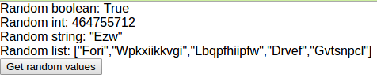

## Generating Random Values

*Elm Version: 0.17.0*

[Try online here](https://alexspurling.github.io/elm-recipes/random/)

This tutorial covers:

* How to generate simple random value
* How to create a custom random value Generator
* How to chain Generators to create complex random values

Recommended background:

* Elm Guide on [Effects](http://guide.elm-lang.org/architecture/effects/)
* Elm Guide on [Random](http://guide.elm-lang.org/architecture/effects/random.html)

Elm is a pure language. This means that within the confines of your application's code, it's not
possible to call a function and get a random value back - unless of course you implement it like
this:


This means, in order to get a random value in your application, you need to ask Elm for it nicely
via the Effects system. This works in the same way as HTTP, Time, and I/O. The 
[Random](http://package.elm-lang.org/packages/elm-lang/core/4.0.1/Random) library provides the
functions you need to be able to tell Elm how to provide values of the types you need.

Elm `Generators` are like recipes that tell Elm how to create random values of any type you like. Just
like [Json Decoders](../json-parsing), You build up `Generators` from simple primitive instances that 
are provided by the library.

#### Creating a Generator

Let's look at an example. Let's say we have a model with 4 values that we want to ramdomize:

```
type alias Model =
  { randomBoolean : Bool
  , randomInt : Int
  , randomString : String
  , randomList : List String
  }
```

We want to write a function with this type signature:

```
randomValueGenerator : Random.Generator Model
```

This custom `Generator` instance should describe how to create a `Model` from a random Bool, Int,
String and List of Strings. Let's start to use the functions provided by the Random library to
do this:

```
randomValueGenerator : Random.Generator Model
randomValueGenerator =
  Random.map4 Model --Model is the function that takes 4 arguments of random values and produces a Model value
    Random.bool
    (Random.int Random.minInt Random.maxInt)
    randomWord
    (Random.list 5 randomWord)
```

The first thing we do is call `map4`. It's important to note that the first argument here `Model` 
is a type constructor function (automatically created when the type was defined) with the signature:

```
Model : Bool -> Int -> String -> List String -> Model
```

The remaining four arguments to `map4` are `Generators` that produces values of the type expected by 
the `Model` constructor function. `Random.bool` is a `Generator` that returns either True or False.
`Random.int` is a `Generator` that returns a value between the min and max values specified.
Finally we have `randomWord` and `Random.list 5 randomWord` which return `Generator String` and 
`Generator (List String)` respectively. Let's take a look at our `randomWord` function:

```
randomWord : Random.Generator String
randomWord =
  (Random.int 0 10) --Random word length
    `Random.andThen`
      (\length ->
        Random.map2 toWord
          uppercaseLetter --First character
          (Random.list length lowercaseLetter) --Remaining characters
      )
```

I wanted to generate a word which had one upper case letter, followed by 0 to 10 lower case letters.
Because I don't know how many random letters to generate in advance, I had to chain two `Generators`
together using the `Random.andThen` function. This has the following signature:

```
andThen : Generator a -> (a -> Generator b) -> Generator b
```

In our case, the first argument is `Random.int 0 10` - a `Generator` that returns an Int between 0
and 10. The second argument is a function that takes that Int and returns another `Generator`. This
time we combine two more generator functions `uppercaseLetter` and `lowercaseLetter` with the
constructor function `toWord`. Let's take a look at these functions:

```
uppercaseLetter : Random.Generator Char
uppercaseLetter =
    Random.map (\n -> Char.fromCode (n + 65)) (Random.int 0 25)


lowercaseLetter : Random.Generator Char
lowercaseLetter =
    Random.map (\n -> Char.fromCode (n + 97)) (Random.int 0 25)
```

This shows how to use `Random.map` to map a randomly generated value of one type (Int) to another type,
in this case, Char. Finally, our `toWord` function describes how to construct the final String that
represents our random word from the first and remaining letters:

```
toWord : Char -> List Char -> String
toWord firstLetter remainingLetters =
    String.fromList (firstLetter :: remainingLetters)
```

(Note that `::` is a function imported from the `List` module that preprends a single element to a given
List to produce a new List).

Don't worry if at this point you're still not sure what is going on here. It took me a while to wrap
my head around the chaining logic of `Generators`. Just remember that any type you might have can be
broken down into its simple primitives and then chained together again with either `andThen` or `map`.

#### Actually generating random values

So how do we use a `Generator`? The Random module provides a function `generate` that can wrap your
generator in a `Cmd`. This can then be passed as a return value of your application's update
function which will tell Elm's Effect Manager to actually generate the random value. Let's see how
this looks in our example's update function:

```
type Msg
  = GetRandomValues
  | NewRandomValues Model

update : Msg -> Model -> ( Model, Cmd Msg )
update msg model =
  case msg of
    GetRandomValues ->
      ( model, Random.generate NewRandomValues randomValueGenerator )
    NewRandomValues randomModel ->
      ( randomModel, Cmd.none )
```

We've defined two types of `Msg`, when the first is called, we call `Random.generate` with our
`randomValueGenerator` function that we defined earlier, along with the Msg type that we want
Elm to call our `update` function with along with the new random value. It's kind of like we're 
saying to Elm: "Here's a recipe for how to produce my random model, please get back to me at this 
address when you have what I need". When the message `NewRandomValues` is passed to the `update`
function it has our new `Model` as a payload. We simply tell Elm to use this as the new state 
for the application.


#### Conclusion

You should now hopefully understand how to create random value generators for your own Elm types.
Please have a look at the rest of the code in Main.elm to see the parts not covered here.

[Try online here](https://alexspurling.github.io/elm-recipes/random/)



